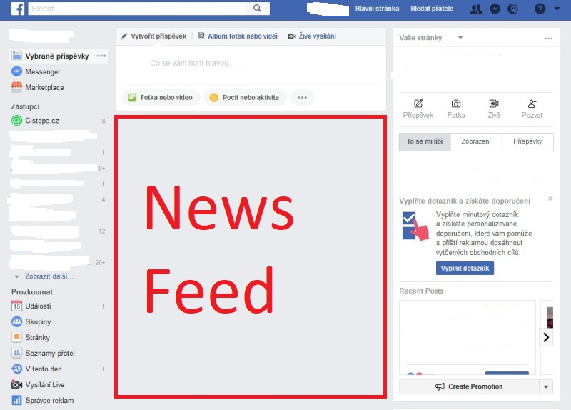
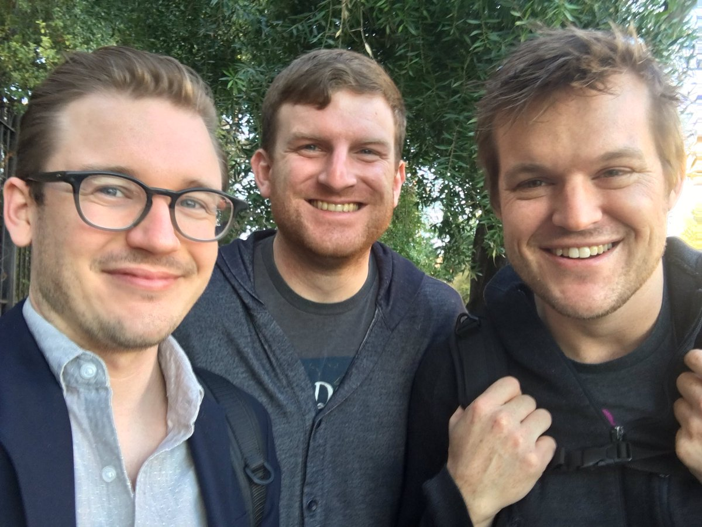
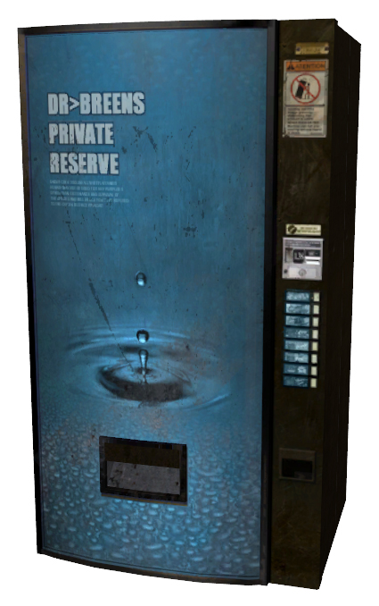
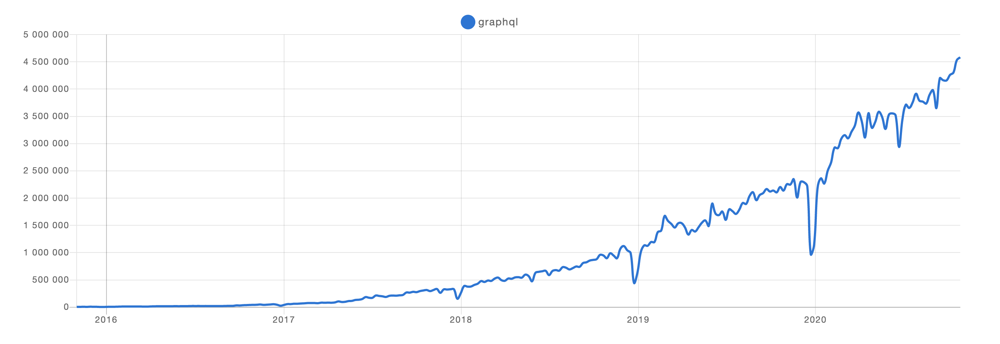
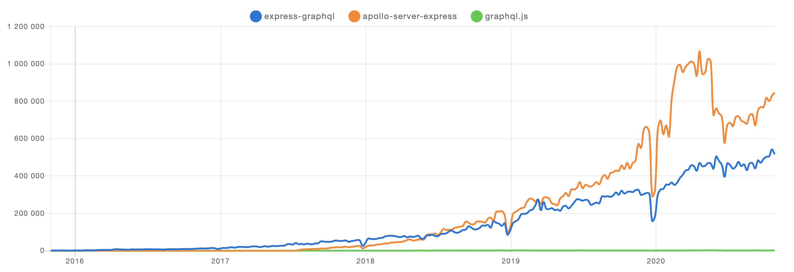
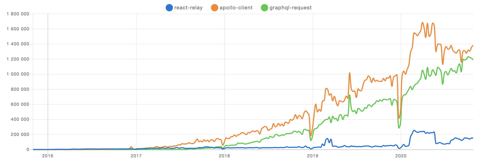

<div style="width: 100%;display: flex; align-items: center; flex-direction: column;">
<h1>GraphQL</h1>

</div>

---

- Autorem GraphQL je Facebook
- V roce 2012 se začal trh orientovat stále více na mobilní aplikace
- Byl vytvořen tým vývojařů, kteří začli pracovat na nativní iOS aplikaci
- Ihned narazili na potíže se stávající API, konrétně s newsfeed API

---

</img>

---

- Stávající API byla navržena tak, že vetšina logiky probíhala na serveru
- Pro nativní iOS appku bylo potřeba, aby vetšina logiky probíhala v appce a na server se chodilo jen pro data
- Skrze Facebook se začalo uvažovat o možnostech úpravy stávající API

---

</img>

<div style="color: white; z-index: 1; position: absolute; bottom: 90px">
Lee Byron
</div>
<div style="color: white; z-index: 1; position: absolute; left: 40%; bottom: 90px">
Dan Schafer
</div>
<div style="color: white; z-index: 1; position: absolute; right: 140px; bottom: 90px">
Nick Schrock
</div>

---

- Nick Schrock napsal první prototyp pojmenovaný <strong>SuperGraph</strong>
- To se velmi líbilo Leeovi (super IT genius), který začal přidávat vlastní nápady
- Brzy se přidal i Dan

---

<div style="display: flex; justify-content: center;">
</img>
</div>

---

- Během 14ti dní měli hotovou první funkční verzi a během pár měsíců vytvořili první produkční verzi, zatím pouze pro Facebook (2012)
- V roce 2015 přišel Nick s nápadem GraphQL open sourcovat, nesetkal se s vřelým přijetím, ale eventuálně se odsouhlasilo, že se GraphQL stane open source projektem. Došlo k tomu v druhé půlce roku 2015. Nejprve však specifikace prošla kompletním refactoringem.
- Nebyla zveřejněna konkrétní interní implementace Facebooku, nýbrž pouze dokument, co to GraphQL je. Konkrétní implementace začala tvořit komunita, nadšená z tohoto nápadu
- Brzy se zjistilo, že spousta firem řeší podobné problémy, jako řešil Facebook
- Došlo k rychlé adopci GraphQL a během pár měsíců byli hotové implementace pro mnoho jazyků

---

## Kdo GraphQL používá?

- Facebook
- Twitter
- AirBnb
- Prisma
- GitHub
- Shopify
- Pinterest
- Audi
- DailyMotion
- PayPal
- Yelp
- a mnoho dalších.....

---

</img>

---

- GraphQL samo o sobě není implementace, nýbrž specifikace postavená nad HTTP protokolem
- Implementace jsou tvořeny týmy třetích stran
- Příklady serverových knihoven pro Node - `grapql.js, express-graphql, apollo-server atd.`
- Příklady klientských knihoven - `Relay, Apollo Client, graphql-request, lokka, nanogql atd.`
- Oproti tradičnímu RESTu GraphQL vystavuje pouze jeden endpoint a následné interakce se zpracovávají tzv. resolvery
- Dotaz na GraphQL server se nazývá `query`
- Každý GraphQL server má out-of-the-box API dokumentaci
- apollo-server automaticky cacheuje data pro `typeDefs` objekt, lze však cacheovat pole i manuálně pomocí `@cacheControl`)

---



---



---

- REST vrací JSON odpověďi, které jsou častokrát velmi obsáhlé a zároveň né vždy úplné, tzn. že pro získání konečných dat je potřeba udělat několik requestů a následně data pospojovat (toto se dá samozřejmě řešit na BE, nicméně není to pravidlem)
- GraphQL oproti tomu umožňuje navzájem propojená data vracet v jednom query, tím se docílí optimalizace síťového přenosu a přenesených dat
- Klient má pod kontrolou, jaká data chce

---

## REST Příklad

GET /users

```
{"users": [
  {"name": "Johny Mačeta", "id": 7}
  .....
]}
```

GET /users/:id/books

```
{"books": [
  {"authorId": 7, "id": 2, "title": "My Little Pony" }
  .....
]}
```

---

## GraphQL Příklad

```
query {
  users {
    id
    name
    books {
      id
      title
    }
  }
}
```

Response

```
{"users": [
  {"name": "Johny Mačeta", "id": 7, "books": [{"id": 2, "title": "My Little Pony" }]}
  .....
]}
```

---

- GraphQL je silně otypované, díky tomu je celkem obtížné "šlápnout vedle"
- Věškeré interakce a datové modely jsou součástí schématu, ve kterém jsou zaznamenány i vztahy mezi jednotlivými modely

---

### 3 základní pilíře GraphQL schématu

- `Queries` - dotazy
- `Mutations` - změny dat
- `Subscriptions` - real time funkcionalita

---

### Každý pilíř je složen z tzv. resolverů, které se starají o zpracování query.

- Resolver je funkce, která zpracuje query a vrátí požadovanou odpověď
- Každý resolver dostává 4 argumenty:

  - `parent` - ve specifických případech odkazuje na rodičovský objekt
  - `args` - argumenty předané do volání query
  - `context` - např. obsahuje informace o requestu, headers atd. (musí se zaregistrovat)
  - `info` - bohužel, o infu moc infa nemám :-D

- Resolvery můžou být asynchroní
